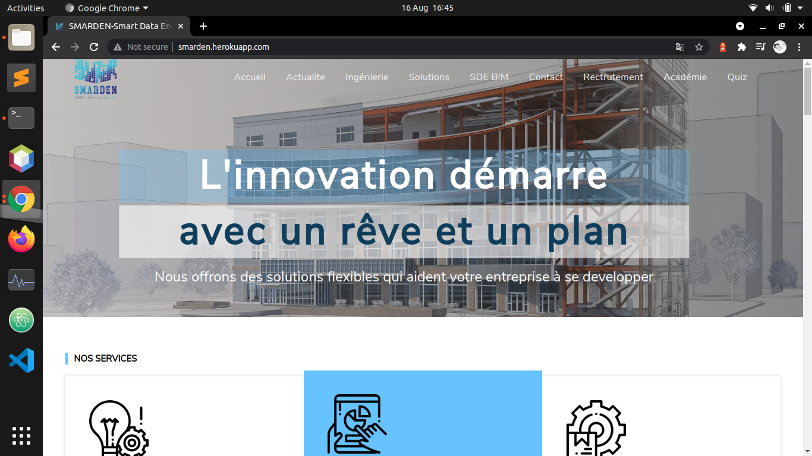
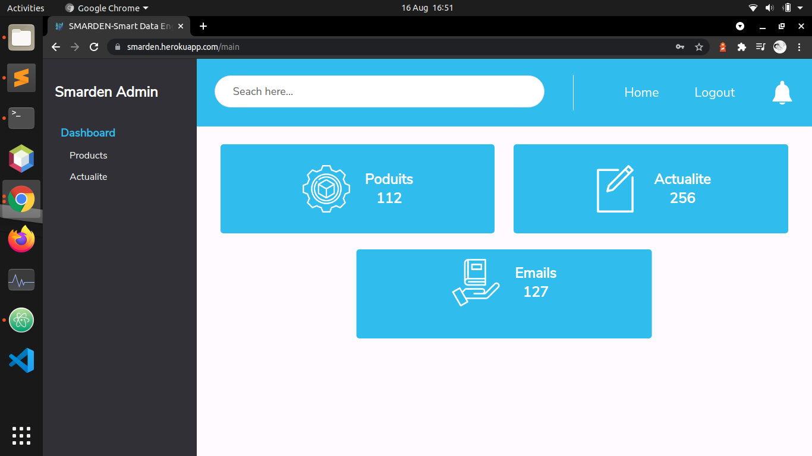

 # MEAN

## This is MEAN Stack App :



 **Technology** : *Angular , MongoDB , Node.js , Express , Typescript , SCSS .*

**This is App Link : [Link to Smarden](https://smarden.herokuapp.com/)**

With Admin Scheduler :




> install dependencies and run the project
 ```javascript
  npm run client-install
  npm install
  npm run dev
 ```


